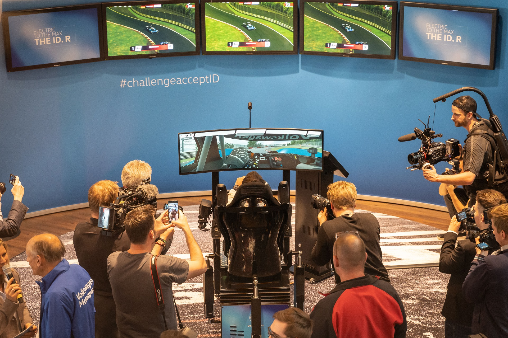

# RRE TV Overlay

As used by:

* [German ADAC GT Masters](https://www.adac-gt-masters.de/uk)
* [AVIA Racing](https://www.avia-racing.de/nc/startseite.html)
* [VirtualRacing.org](https://www.virtualracing.org/home/)
* [Volkswagen I.D R Nurburgring Launch Event](https://www.gtplanet.net/volkswagen-partners-with-raceroom-for-id-r-nurburgring-competition/)
* [Tuning World Bodensee](https://www.raceroom.com/en/raceroom-esports-event-at-the-tuning-world-bodensee-2019/)
* R3E Special Event Series
* ... any many more events.

### Changelog
* [Version Changelogs](changelog.md)

## Getting Started
1. Install http://nodejs.org/.
2. Run `start.bat`.
3. Add `-broadcastUrl=http://localhost:9090` in Steam Game launch options.
4. Open http://localhost:9090 in a browser.
5. Join a server.

### Using UI Toggles
Inside the broadcasting control panel in the browser, there is a settings icon in the top left hand corner. Clicking on this will bring up a popup with toggles and input boxes that can be used to change the appearance and functionality of the UI.

### Resolution: Scaling UI Elements
The `resolutionScaler.less` file contains a config value which allow you to manually increase/decrease UI elements based on your resolution.

Setting the px value to a higher number will increase scaling and setting a lower number will decrease scaling.

### Creating Your Own Theme
To create your own theme, its recommended to create a copy of the `raceroom-red.less` file with your theme name. Then start the tool, select the theme from the dropdown and start modifying the less variables.

Select the theme from the dropdown to view the results on screen.

### License
The [Unlicense](LICENSE).
